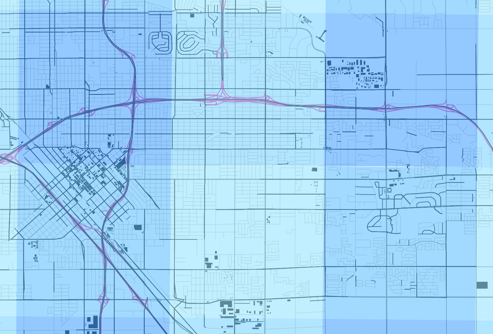
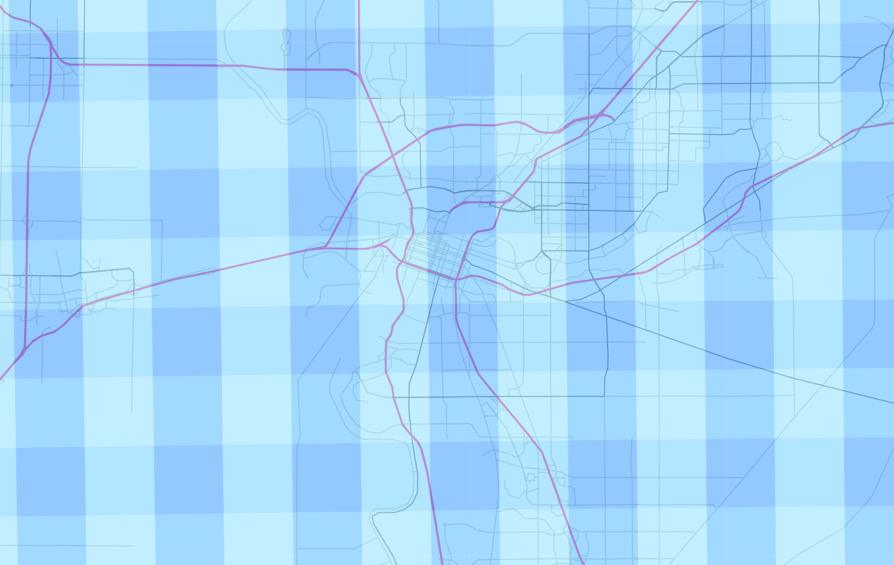

% Map-reduce, callbacks, and crashing node.js
% James E. Marca
% 2015-03-19

# Overview

* Node is great for systems programming
* But callbacks can be tricky
* It's easy to get carried away with thousands of callbacks and crash
node

# The use case

* CalVAD:  the California Vehicle Activity Database
* California Air Resources Board (ARB) wants a picture of vehicle
  activity every hour of every day

# All the data:

* 10,000+ loop detectors
* 100+ weigh in motion stations
* estimated annual vehicle counts on every street

----------


----------


----------


# The problem

* Two day tube counts =>  average daily traffic (AADT)
* Model most likely hour, daily variation
* Using loops and WIM detectors


# 4km X 4km grid

* map roads and highways to grid cells
* model most likely variation from AADT
* by hour (per year)
* by grid cell

----------


----------



----------


----------




# use R

* marshalled data and jobs using node.js
* spatio-temporal modeling in R
* hourly, grid by grid results stored in CouchDB
* (not today's topic)

# Today's topic: Aggregating step

* ARB wanted to look at area sums
* With freeway and street data combined
* Can't use CouchDB's built-in map reduce


# use Node.js!

* get data from all databases (map)
* sum it all up (reduce)


# Logic

1. Get the grids in a county
2. For each grid and all hours in a  year

    1. get the hourly fwy data
    2. get the AADT from each road in the grid
    3. get the hourly "variation"
    4. multiply 2 and 3
    5. sum 1 and 4

6. put the result from line 5 in form 1040 line 21 and read
   paragraph 7 to find out if you have to file Schedule Q


# Version 1

* use the async library
* lots of bells and whistles like async.reduce
* npm install async


# Main loop

```javascript
var async = require('async')
var config_okay = require('config_okay')
# ...command line stuff...
var year = argv.year
var area_type = argv.area_type

config_okay('config.json',function(err,conf){
    process_area_year(conf,area_type,year,function(e){
        if(e) throw new Error('died')
        console.log('done')
    })
})
```


# Processing

```javascript
var jobs = argv.jobs
var _ = require('lodash')

function process_area_year(config,area_type,year,cb){
    var area_queue = async.queue(area_handler,jobs)
    area_queue.drain = function() {
        return cb()
    }
    _.each(years,function(yr){
        var tasks=
            _.map(grid_records,function(membership,cell_id){
                return {'cell_id':cell_id
                       ,'year':yr
                       ,'options':config
                       ,'area_type':area_type
                       ,'area_name':membership[area_type]
                       }
            });
        var grouped_tasks = _.groupBy(tasks,function(t){
                                return t.area_name
                            })

        _.each(grouped_tasks,function(tasks,group){
            console.log({'tasks.length':tasks.length})
            area_queue.push([tasks])
        });
        return null
    });
    return null
}
```

# What is a reduce function?

> The reduce() method applies a function against an accumulator and
> each value of the array (from left-to-right) has to reduce it to a
> single value.

# (Reduce docs)

Excellent write-up at [https://developer.mozilla.org](https://developer.mozilla.org/en-US/docs/Web/JavaScript/Reference/Global_Objects/Array/Reduce)


# Reduce example

```javascript
var total = [0, 1, 2, 3].reduce(function(so_far,next_item ) {
  return so_far + next_item;
});
```

The return value of the function is passed in the next iteration as
the new value of "so_far".

(The answer is 6.)


# Area-wide handler

* Do everything necessary to process an area
* Reduce each grid cell's result to produce the spatial aggregate
* Output is summed up traffic values for every hour for the area

# Per grid handler

* Do everything necessary to process a grid
* Put the tasks in the form of a "reducing" function

# area_handler

```javascript
function area_handler(tasks,reducing_callback){
    async.reduce(tasks
                ,{}
                ,function(memo,item,cb){
                     processing_waterfall(item,function(e,t){
                         grid_reduce(memo,t,cb)
                     })
                     return null
                 },function(err,red_res){
                       var finish_task = {'grid_cells':_.pluck(tasks,'grid_cell')
                                         ,'area_type':tasks[0].area_type
                                         ,'area_name':tasks[0].area_name
                                         ,'year':tasks[0].year
                                         ,'result':red_res
                                         }
                       flatten_records(finish_task,function(e,t){
                           put_results_doc({options:tasks[0].options
                                           ,doc:t}
                                          ,function(e,r){
                                               return reducing_callback(e)
                                           })
                           return null
                       })
                       return null
                   })
    return null
}
```

# processing_waterfall

```javascript
function processing_waterfall(task,callback){
    // run through the waterfall of tasks
    async.waterfall([function(cb){
                         return cb(null,task)
                     }
                     //,in_process
                    ,function(t,cb){
                         async.applyEach([get_hpms_aadt
                                         ,get_detector_routes]
                                        ,t
                                        ,function(err,t1,t2){
                                             return cb(null,t)
                                         });
                         return null
                     }
                    ,post_process_sql_queries
                    ,get_detector_fractions
                    ,get_hpms_fractions
                    ,reduce.post_process_couch_query
                    ,reduce.apply_fractions]
                   ,callback
                   )
    return null
}
```

# async_waterfall

* Each element is an a async function
* Each element expect to get the results of the previous function
* In practice, each task item (one grid's state) gets large


# The waterfall ends up in the real reducing function

```javascript
function reduce(memo,item,callback){
    // stash item's street data into memo
    _.each(item.accum,function(roads,ts){
        if(memo[ts]===undefined){
            memo[ts]=_.clone(roads,true)
        }else{
            _.each(roads,function(record,road_class){
                if(memo[ts][road_class]===undefined){
                    memo[ts][road_class]=_.clone(record,true)
                }else{
                    _.each(record,function(v,k){
                        memo[ts][road_class][k] += v
                    })
                }
            })
        }
    });
    // stash item's freeway data into memo
    _.each(item.detector_data,function(record,ts){
        // could also insert speed here into to the sum by
        // multiplying by n to weight it, as I do elsewhere
        var detector_miles = record[unmapper.miles]
        if(memo[ts]===undefined){
            memo[ts]={}
        }
        if(memo[ts]['detector_based']===undefined){
            memo[ts]['detector_based']={'n':record[unmapper.n]
                                       ,'n_mt':record[unmapper.n]*detector_miles
                                       ,'hh_mt':record[unmapper.hh]*detector_miles
                                       ,'nhh_mt':record[unmapper.not_hh]*detector_miles
                                       ,'lane_miles':record[unmapper.lane_miles]
                                       }
        }else{
            memo[ts]['detector_based'].n      += record[unmapper.n]
            memo[ts]['detector_based'].n_mt   += record[unmapper.n]*detector_miles
            memo[ts]['detector_based'].hh_mt  += record[unmapper.hh]*detector_miles
            memo[ts]['detector_based'].nhh_mt += record[unmapper.not_hh]*detector_miles
            memo[ts]['detector_based'].lane_miles += record[unmapper.lane_miles]
        }
    });
    return callback(null,memo)
}
```

# The waterfall ends up in the real reducing function

```javascript
function reduce(memo,item,callback){
    // stash item's street data into memo
        ...code...
    // stash item's freeway data into memo
        ...code...
    return callback(null,memo)
}
```

# It worked when I tested

* a city worked fine
* and small counties too,
* but it didn't scale to a full county

# The problem

* The async.reduce step was passed a list of "tasks"
* Each task was an object, and accumulated its own state from the
various database calls
* At the end of querying a county, I'd have hundreds of grid "tasks"
with hour by hour data on traffic flow still being referenced

# Solution, garbage collecting

* I hate managing memory
* It's why I stopped programming in 68000 assembly language
* But it was needed here

# clean out each task

```javascript
function area_handler(tasks,reducing_callback){
    var options = _.clone(tasks[0].options)
    var area_type = tasks[0].area_type
    var area_name = tasks[0].area_name
    var year = tasks[0].year
    var finish_task = {'area_type':area_type
                      ,'area_name':area_name
                      ,'year':year
                      }
    finish_task.grid_cells = _.pluck(tasks,'cell_id')
    async.reduce(tasks
                ,{}
                ,function(memo,item,cb){
                     var original_item = _.clone(item)
                     processing_waterfall(item,function(e,t){
                         area_reduce(memo,t,function(e,m){
                             // clean up
                             _.each(item,function(v,k){
                                 delete(item[k])
                             });
                             item=original_item
                             cb(null,m)
                         })
                     })
                     return null
                 },function(err,red_res){
                       finish_task.result=red_res
                       flatten_records(finish_task,function(e,t){
                           put_results_doc({options:options
                                           ,doc:t}
                                          ,function(e,r){
                                               return reducing_callback(e)
                                           })
                           return null
                       })
                       return null
                   })
    return null
}
```

# That was code from a year ago

# Last fall I refactored most of it

* using queue-async instead of async
* fewer features, makes me think more

# The new code

```javascript
    tasks.forEach(function(t){
        gridq.defer(handler,t)
    })
    gridq.awaitAll(function(e,results){
        // reduce the results
        finish_task.result =  _.reduce(results
                                      ,reduce.reduce
                                      ,{}
                                      );
        flatten_records(finish_task,function(e,t){
            put_results_doc({options:options
                            ,doc:t}
                           ,function(e,r){
                                return reducing_callback(e)
                            })
            return null
        })

        return null
    })
```

# Even more stupider!

* This time I collected *everything*
* then reduced
* So it crashed, but slowly

# The fix

* I implemented my own version of async reduce

---------

```javascript
var gridq = queue(1)
var memo = {}
function clean_and_compress(item,cb){
    reduce.reduce(memo,item,function(e,m){
        //cleanup
        _.each(item,function(v,k){
            delete(item[k])
        });
        return cb(null)
    });
    return null;
}
tasks.forEach(function(t){
    gridq.defer(function(cb){
        handler(t,function(e,t2){
            console.log('handled '+t2.cell_id)
            clean_and_compress(t2,cb)
            return null
        });
        return null
    })
})
gridq.awaitAll(function(e,results){
    ...
```

# Batch mode?

* possible now with my "manual" async reduce
* feed multiple grids to couchdb at a time
* batch the data processing steps
* reduce the cost of CouchDB queries

# Why bother?

* Long experience pushing database queries
* I stick to about 10,000 docs at a time from CouchDB
* already getting 8,000 docs with each query
  (365 days * 24 hrs)

# ES6 Generators?

* Inspired by last night's talk in OC, I hacked on some ES6 ideas.


# "Streets"

```json
{
   "_id": "100_223_2007-01-01 02:00",
   "_rev": "1-e1f162eeb6a9980b62a6d97f300fa46d",
   "i_cell": 100,
   "j_cell": 223,
   "aadt_frac": {
       "n": 0.022545,
       "hh": 0.030324,
       "nhh": 0.025502
   },
   "ts": "2007-01-01 02:00",
   "geom_id": "100_223"
}
```

# Freeways

```json
{
   "_id": "122_184_2007-01-01 05:00",
   "_rev": "1-328420027e1bd4925e676a46ea375771",
   "geom_id": "122_184",
   "i_cell": 122,
   "j_cell": 184,
   "data": [
       "2007-01-01 05:00", "101", 1592.7,
        268.43, 177.71, 0.01, 67.89,
        50.99, 5.05, 60.58,
        16.3,  2.3,  59.4,
        5.49, 16.48, 2,
       "401602", "401609"
   ],
   "aadt_frac": {
       "n": 0.005267,
       "hh": 0.020117,
       "not_hh": 0.013180
   }
}
```

# "Header" document

```json
{
   "_id": "header",
   "_rev": "2-3faf29e8ba8588d3067f7fa28fb169e1",
   "unmapper": {
   },
   "header": [
       "ts","freeway","n",
       "hh","not_hh","o","avg_veh_spd",
       "avg_hh_weight","avg_hh_axles","avg_hh_spd",
       "avg_nh_weight","avg_nh_axles","avg_nh_spd",
       "miles","lane_miles","detector_count",
       "detectors"
   ]
}
```
